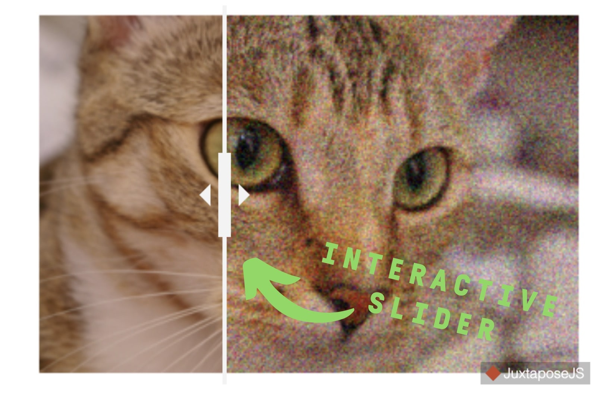
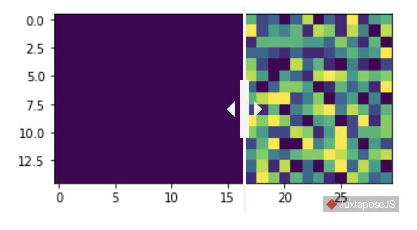

Jupyter Splitview
=================

A cell magic that displays images in splitview using https://github.com/NUKnightLab/juxtapose.  
*NOTE: Still work in progress, there will be breaking changes.*
## Installation
```py
pip install jupyter-splitview
```
## Example
```py
import jupyter_splitview
```

```py
%%splity

from skimage import data
from skimage.util import random_noise
import matplotlib.pyplot as plt

img = data.chelsea()
noisy_img = random_noise(img, var=0.02)

fig, ax1 = plt.subplots()
ax1.axis('off')
ax1.imshow(img)

fig, ax2 = plt.subplots()
ax2.axis('off')
ax2.imshow(noisy_img)
```



Note: The split view widget is still responsive after closing and reopening the notebook without running the cell again.

Another example:
```py
%%splity --position 73% --height auto
import matplotlib.pyplot as plt
import numpy as np

array1 = np.full((15, 30), 10)
array2 = np.random.randint(0, 10, size=(15, 30))
fig, ax1 = plt.subplots(figsize=(5, 10))
ax1.imshow(array1)
fig, ax2 = plt.subplots(figsize=(5, 10))
ax2.imshow(array2)
```



## Notebook arguments

* `--position 73%` will set the slider start position to 73%.
*  The height of the widget. 
* `--height 220` will set the height to 220 pixel. 
* When `--height`is not provided, the default height of the widget is 300 pixel.
* `--height auto` will set the height by the value of the first image's resolution in vertical direction.
* The widget's width will always be adjusted automatically. 

## Notebook formatting
Formatting with black can be done this way: 
1. `pip install 'black[jupyter]'`
2. `black --python-cell-magics splity splitview_magic.ipynb`


## Developer Installation

1. `git clone --recurse https://github.com/kolibril13/jupyter-splitview`
(Note: In case that the repo was already cloned e.g. with the GitHub Desktop client, the  GitHub submodule has to be loaded via `git submodule update --init --recursive` )
2. `poetry install`

## Changelog

## Milestones for >0.0.5

* Handle cases where n ≠ 2 images. Currently: All further img are ignored.
* implement tests, find out how to test a magic class

* Idea: Second option without using cell magic:
```python
from splitview import Splity # (does not yet exist)
my_splity = Splity(left_layer=img1, right_layer=img2)
display(my_splity)
```

## 0.0.5 (Work in Progress)

* Ship the javascript directly with the package, so no internet connection is required
* Make this work also in VSCode notebooks, [see this issue](https://github.com/NUKnightLab/juxtapose/issues/178).
* Maybe change backend to https://github.com/onion2k/split-view ?

## 0.0.4 

* New `--height` parameter
## 0.0.3

* default slider position
* updated minimal example
* internal code restructuring and formatting
* Handle import in non jupyter context

### 0.0.2 
* save images in base64 strings and don't load images to disk (increases package security).
### 0.0.1

* First release


