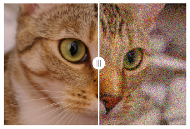

jupyter-splitview NOT YET WORKING
===============================

A splitview widget

Example of the concept:
```python
from skimage import data
from skimage.util import random_noise
import matplotlib.pyplot as plt
import numpy as np

img = data.chelsea()
noisy_img = random_noise(img, var=0.02)

fig1= plt.figure()
plt.imshow(img)
plt.axis('off')
fig2= plt.figure()
plt.imshow(noisy_img)
plt.axis('off')

#new part (does not exist yet):
from splitview import SplitMapControl
control = SplitMapControl(left_layer=fig1, right_layer=fig2)
m.add_control(control)
m
```


Installation
------------

To install use pip:  ~~pip install splitview~~ NOT YET WORKING!
    $ jupyter nbextension enable --py --sys-prefix splitview

To install for jupyterlab

    $ jupyter labextension install splitview

For a development installation (requires npm),

    $ git clone https://github.com/kolibril13/jupyter-splitview.git
    $ cd jupyter-splitview
    $ pip install -e .
    $ jupyter nbextension install --py --symlink --sys-prefix splitview
    $ jupyter nbextension enable --py --sys-prefix splitview
    $ jupyter labextension install js

When actively developing your extension, build Jupyter Lab with the command:

    $ jupyter lab --watch

This takes a minute or so to get started, but then automatically rebuilds JupyterLab when your javascript changes.

Note on first `jupyter lab --watch`, you may need to touch a file to get Jupyter Lab to open.

